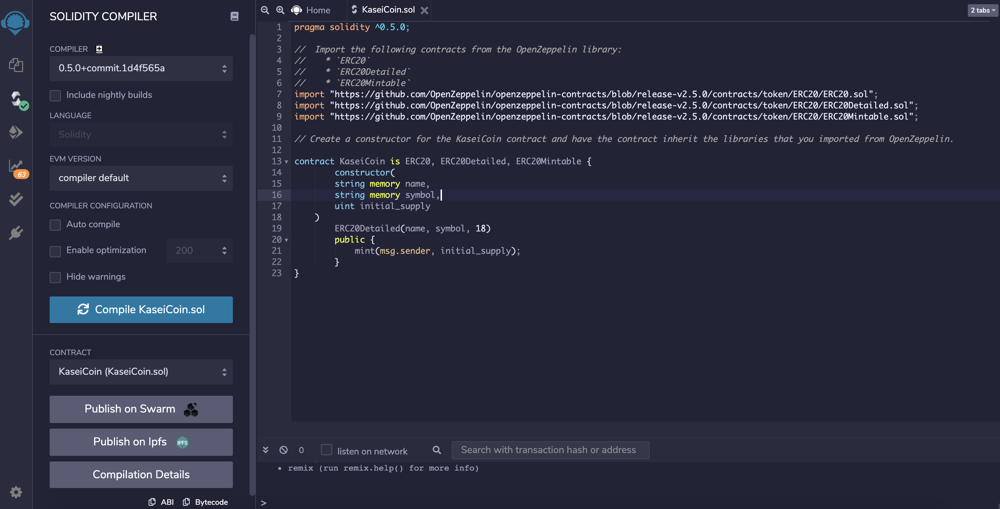
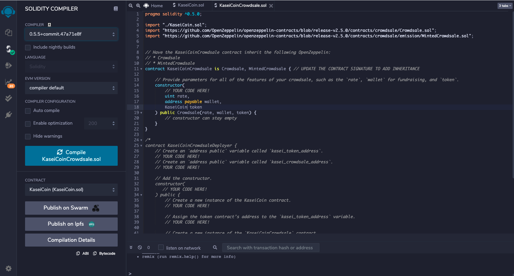
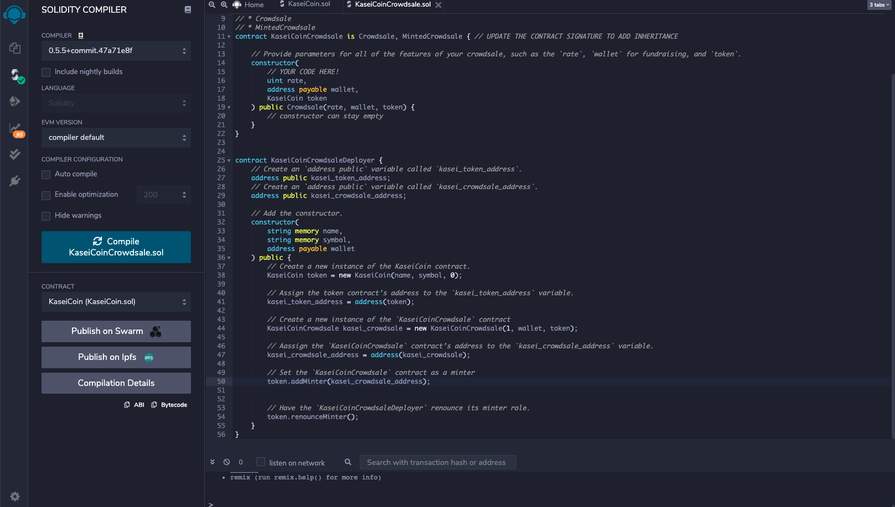
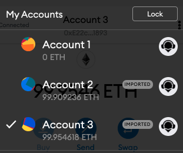
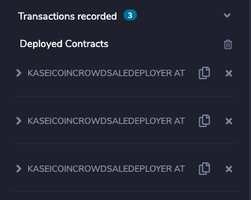

# KaseiCoin

## Martian Token Crowdsale

We will create a fungible token that is ERC-20 compliant and that will be minted by using a `Crowdsale` contract from the OpenZeppelin Solidity library.

The crowdsale contract that we create will manage the entire crowdsale process, allowing users to send ether to the contract and in return receive KAI, or KaseiCoin tokens. Your contract will mint the tokens automatically and distribute them to buyers in one transaction.

---

## Technologies

This project uses the web version of Remix IDE to Code in the Solidity Language:

- Remix IDE: to build and test smart contracts that you create with Solidity. The Remix IDE is an open source application for developing, deploying, and administering smart contracts that run in Ethereum-based blockchains. We can use this IDE for the entire development cycle of smart contracts and as a playground for teaching and learning Ethereum.
- Ganache: a tool that allows you to quickly set up a local blockchain, which you can use to test and develop smart contracts.
- MetaMask: a digital wallet for the Ethereum blockchain.

---

## Installation

You will need to install Metamasak and Ganache to your local device.

Follow the instructions on the [MetaMask Download page](https://metamask.io/download) to install MetaMask in your web browser.

Follow the instructions on the [Ganache Download page](https://www.trufflesuite.com/ganache) to download and install this tool on your local machine.

---

## Evaluation Evidence

Here are a couple of screenshots showing interactions with the of the Compiled and Deployed Smart Contract

_^ Compiling Kasei Coin Token Contract_

_^ Compiling the KaseiCoin Crowdsale Contract_

_^ Creating the Kasei Coil Deployer Contract_

_^ Deploying the Crowdsale to a Local Blockchain_

_^ Checking the Balances of the Accounts_

_^ Transactions Total for Deploying the Crowdsale_

## Contributors

Michael Husary was the main contributer along with the instructional staff. 
